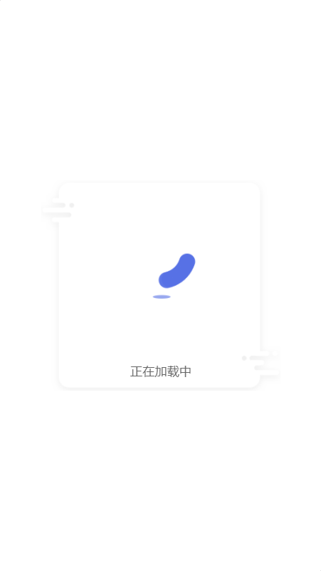

# 基于Vue3的loading和toast插件

> css 动画样式使用的 vivify 动画组件中的部分动画

##  loading

> 在 main.js 进行引入并初始化

```javascript

import {loading, dialog} from './plugins';

createApp(App)
  .use(loading)
  .mount('#app')
```

> xyhLoading(type, msg);

| Param |  Type     | Description       |
| :---- | :----:    | :---------------  |
| type  | Boolean   | 是否展示            |
| msg   | String    | loading 提示语句    |

>  示例

```javascript
import { inject, onMounted } from "vue";

export default {
  name: "App",
  setup() {
    const loading = inject("xyhLoading");

    onMounted(() => {
      loading(true, "正在加载");
      setTimeout(() => loading(false), 2000);
    });
  },
};

```



##  dialog

> 在 main.js 进行引入并初始化

```javascript
import {loading, dialog} from './plugins';

createApp(App)
  .use(dialog, {theme: '#d84315', color: 'white'})
  .mount('#app')
```

> options

| Param |  Type     | Description       |
| :---- | :----:    | :---------------  |
| theme  | String   | 确认按钮背景色            |
| color   | String    | 文字颜色    |


> xyhToast(options)

| Param |  Type     | Description       |
| :---- | :----:    | :---------------  |
| duration  | Number   | 展示时间，字段为0时展示按钮组            |
| type   | Number    | 0：成功，1：警告，2：错误    |
| title | String | 标题 |
| content | String | 内容 |
| confirmText | String | 确认按钮内容 |
| showCancel | Boolean | 展示取消按钮 |
| cancelText | String | 取消按钮内容 |
| callback[res] | Function[Boolean] | 回调方法，返回点击按钮，确认按钮返回true，取消按钮返回false

> 示例

```javascript

import { inject, onMounted } from "vue";

export default {
  name: "App",
  setup() {
    const dialog = inject("xyhDialog");

    onMounted(() => {
      const options = {
        type: 1,
        content: "您确定要删除当前元素吗？",
        confirmText: "确定",
        showCancel: true,
        cancelText: "取消",
        callback: (res) => console.log(res),
      };
      dialog(options);
    });
  },
};

```


> 出现问题欢迎反馈至<https://github.com/xyhxx/Vue3Plugins>，谢谢！